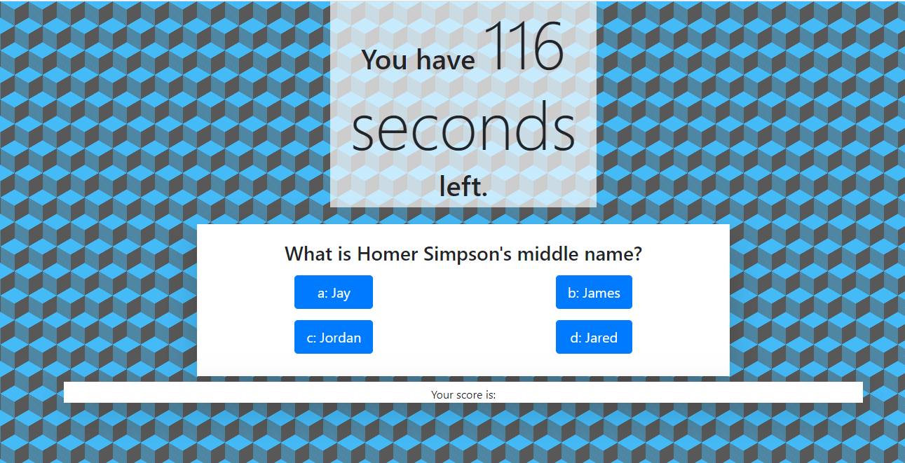
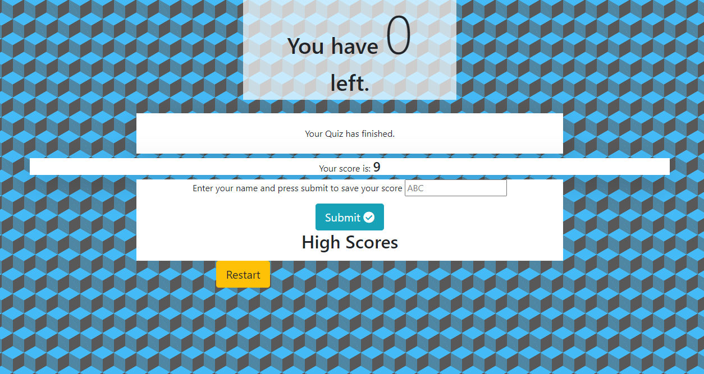

# super-cool-JS-quiz

## User Story

```
AS A coding boot camp student
I WANT to take a timed quiz on JavaScript fundamentals that stores high scores
SO THAT I can gauge my progress compared to my peers
```


## Acceptance Criteria

```
GIVEN I am taking a code quiz
WHEN I click the start button
THEN a timer starts and I am presented with a question
WHEN I answer a question
THEN I am presented with another question
WHEN I answer a question incorrectly
THEN time is subtracted from the clock
WHEN all questions are answered or the timer reaches 0
THEN the game is over
WHEN the game is over
THEN I can save my initials and score
```


## Features

- When start button is pressed the quiz starts and a random question is displayed and a timer starts
- When a user chooses an answer, answer buttons change colors based on whether correct or incorrect
- When user chooses incorrect answer, time in subtracted from total
- When all questions have been answered or time runs out, quiz stops, score is totaled and user is able to input their initials and save their score

### Troubleshooting Needed

```
I have not figured out how to display the scores saved to localStorage to the page.
Scores are saved but not rendered to page.
```

### Screenshots of Work

#### Mid-quiz Screenshot


#### Finished Quiz Screenshot


### Deployed Page

https://peter-izzo.github.io/super-cool-JS-quiz/
